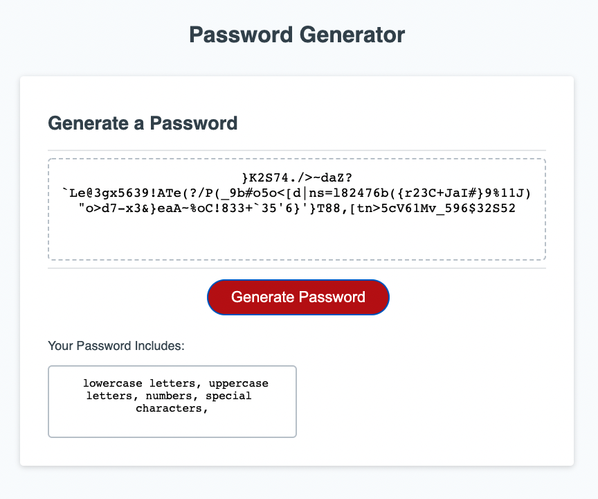

# Password Generator

## Description

I created the logic behind this password generator in javascript. I used three
different functions to accomplish this. Upon clicking the "Generate Password" button the "writePassword" function gives several prompts to the user to determine the character types they want present in their password. After getting that information from the user it calls the "generatePassword" function which uses a loop to call the last function "character" repeatedly until the amount of characters desired is reached.

## Link

https://jakemporter.github.io/Module-3-Challenge/
